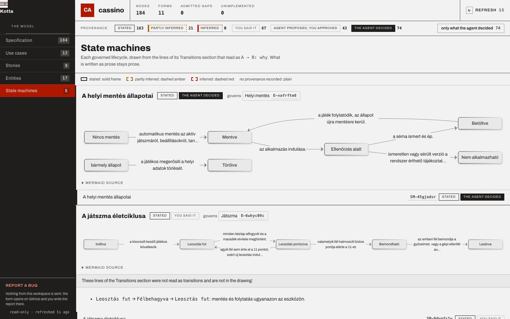
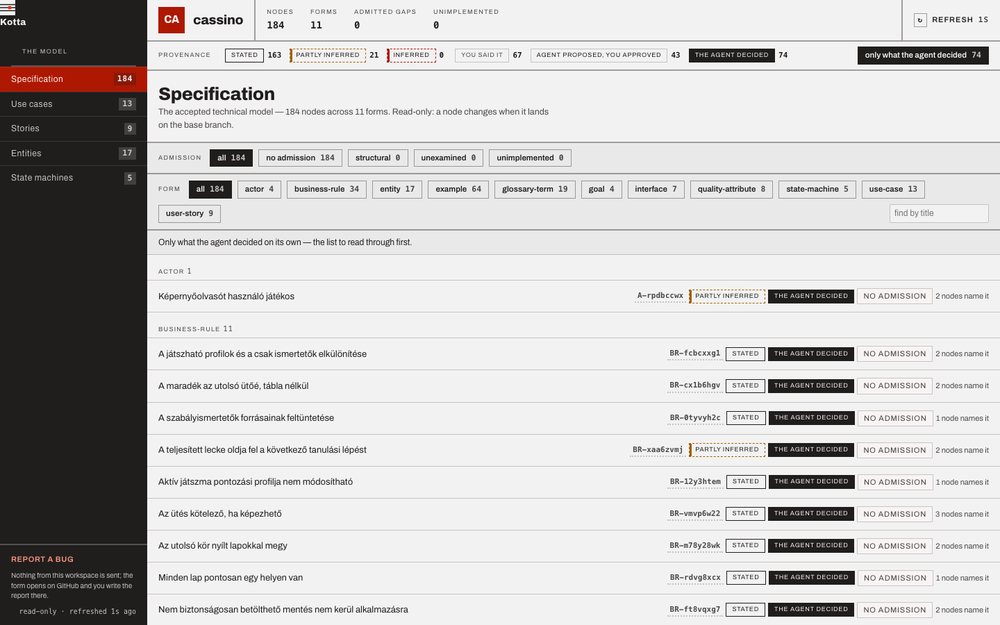
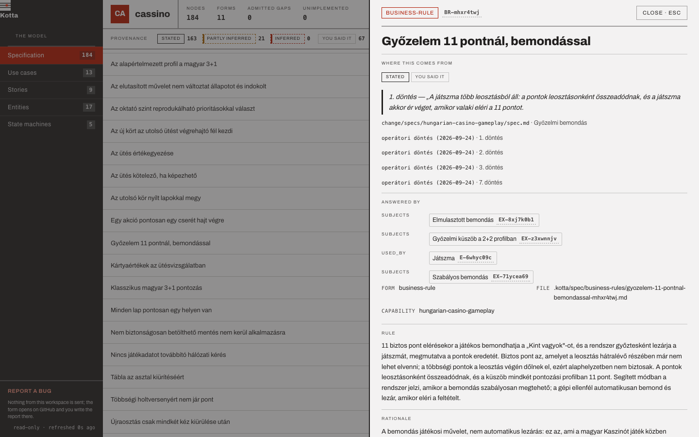

# The board

`kotta ui` serves a local, read-only board of the accepted model: the nodes, the diagrams drawn from
them, and where every node came from.

```bash
kotta ui                      # starts at port 4311, or the next free one, and opens a browser
kotta ui --port 5190 --no-open
```

| Option | Effect |
| --- | --- |
| `--workspace <path>` | the repository root or workspace directory (default `.`) |
| `--port <port>` | a fixed port; without it the board starts at 4311 and advances to the next free port |
| `--host <host>` | the bind host (default `127.0.0.1`) |
| `--no-open` | print the URL without opening a browser |
| `--json` | print the URL as JSON; never opens a browser |

## What it reads

The board reads `.kotta/` from the configured base branch through Git, not from your working tree.
A node you have not committed to the base branch is not on the board yet; when the base branch has
no nodes and the working tree has some, the board says so. It follows the system's light or dark
theme.

It is read-only: it answers `GET` and `HEAD`, and every other method gets `405` with
"The Kotta board is read-only."

## The views

The rail on the left lists five views, each with its node count.

| View | Shows |
| --- | --- |
| Specification | every node, grouped by form, with filters by admission kind and by form, and a find-by-title box |
| Use cases | actors, use cases grouped by capability, and goals: an actor owns a use case by its actor edge (solid arrow), a use case serves a goal by its goal edge (dashed arrow) |
| Stories | the story map: one column per actor, each story with its Story and Value |
| Entities | the entity map |
| State machines | one diagram per state machine, drawn from the Transitions lines that read as `A → B: why`; lines that do not are listed under it as prose |

Diagrams are Mermaid, loaded only when a diagram opens; each has a "Mermaid source" toggle. A
diagram draws a node's provenance level as its frame: stated is solid, partly inferred dashed amber,
inferred dashed red, and a node with no provenance plain.



## Provenance badges and the filter

The header counts the model by level and by decider, with the same badges every node row carries:

| Badge | Means |
| --- | --- |
| stated · partly inferred · inferred | `provenance.level` |
| you said it | `decided_by: human` |
| agent proposed, you approved | `decided_by: agent-proposed-human-approved` |
| the agent decided | `decided_by: agent-decided` |

A node without provenance gets no badge, never a guessed one. The button **only what the agent
decided** turns every view into the review list; the diagrams dim the rest.



## A node

Opening a node shows, under **Where this comes from**, its badges, its quote, what was filled in,
and each source. Below come the edges it answers and the nodes that answer it, its form, file and
capability, and its sections.



When a source cites a file under `openspec/` — a change's `conversation.md · J3` — the board fetches
it from `/api/narrative?path=<repository-relative path>` and shows the cited part in place, with the
whole file folded below. The endpoint serves only Markdown files under `openspec/`, up to 1 MB, read
from the working tree, and refuses absolute paths, `.` or `..` segments and links that lead outside.

## The rest of the header

The header also shows the project name and workspace path, the number of nodes, forms, admitted gaps
and `unimplemented` admissions, a **Refresh** button with the time since the last read, and a
**Report a bug** link in the rail.
