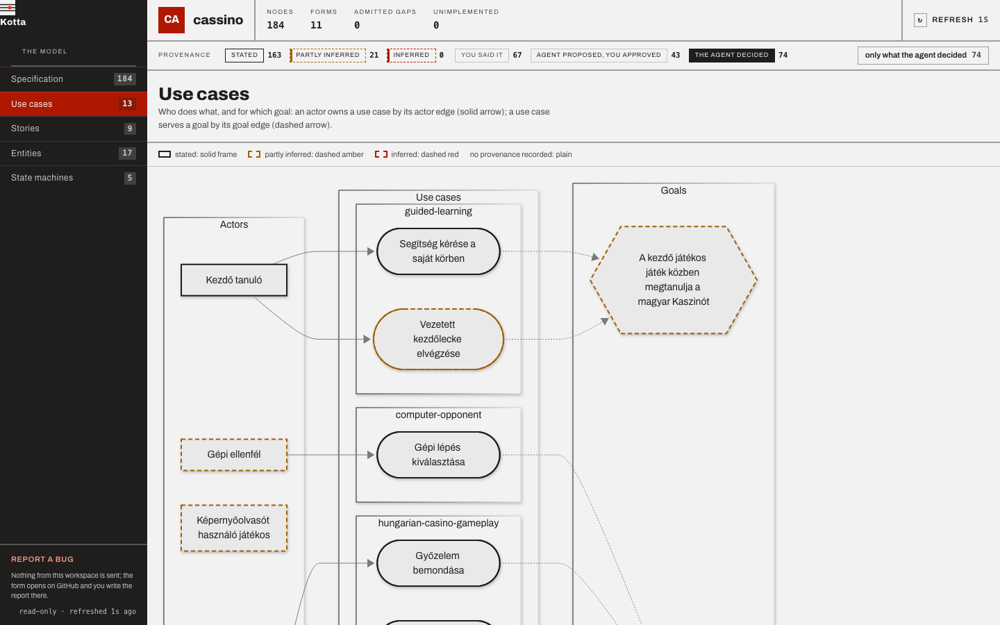

# Getting started

Install Kotta, set up a repository, and carry one change from prose to the accepted model in about
ten minutes. The excerpts come from a real project: a Hungarian card-game PWA ("Kaszinó") whose
first change went through every step below.

## Install

You need Node.js 20 or newer, Git, and a coding-agent host that reads skills from
`~/.claude/skills`.

```bash
npm install --global @arpadtamasi/kotta@next     # or the exact version: @arpadtamasi/kotta@1.0.0-alpha.1
kotta --version
```

1.0 is a pre-release, published under the `next` dist-tag. A plain `npm install --global
@arpadtamasi/kotta` still installs the last 0.x release; see [Migrating from 0.x](migration.md).

## Set up the repository

In the root of a Git repository:

```bash
kotta init
```

```text
Created workspace at /path/to/repo, and 14 skills are installed.
Rules: created /path/to/repo/.kotta/AGENTS.md.
The project had no AGENTS.md; Kotta created /path/to/repo/AGENTS.md pointing at the rules with @.kotta/AGENTS.md.
Nothing here is committed yet. Look it over, then commit the workspace and the AGENTS.md it created for you.
```

`init` writes `.kotta/` (the form registry under `spec/forms/`, one directory per form, the
workspace `README.md`, `config.yaml` and the rules file `AGENTS.md`) and installs the shipped skills.
If you use Codex, connect Kotta's read-only tools to its project chat:

```bash
kotta integrate codex   # writes an [mcp_servers.kotta] block into .codex/config.toml
```

Commit what `init` wrote. Kotta itself never commits.

## Your first change

A change is an OpenSpec change directory. Kotta adds the model beside the prose.

### 1. Write the change in prose

Write `openspec/changes/<name>/proposal.md` (and `specs/` if you use them) the way you already do,
with OpenSpec's tooling or by hand. Kotta only needs the directory to exist. The casino change
opened like this:

```markdown
## Why

A magyar Kaszinó kártyajátékhoz nincs könnyen elérhető, telefonra optimalizált alkalmazás, amely
játék közben tanítja meg a hazai szabályokat, offline is használható, …
```

(There is no easy phone app for Hungarian Kaszinó that teaches the rules while you play and works
offline.)

### 2. Distil the conversation (optional)

If the change was shaped in an agent session, keep who decided what:

```bash
kotta narrative <name> --from ~/.claude/projects/<project>/<session>.jsonl
```

It writes `openspec/changes/<name>/conversation.md`. See [The distilled conversation](narrative.md).

### 3. Translate the prose into the model, in the chat

Ask your agent to plan the change, or type `/plan-change`. The skill reads the proposal, the specs
and the conversation, requirement by requirement, and writes nodes under
`openspec/changes/<name>/model/`, each with a `provenance` block. Where nobody said why, it writes a
question instead of an answer. A rule from the casino model:

```yaml
---
id: BR-01m37bp5e8ws0mrd2qmhxr4twj
form: business-rule
title: Győzelem 11 pontnál, bemondással
capability: hungarian-casino-gameplay
provenance:
  level: stated
  decided_by: human
  sources:
    - "change/specs/hungarian-casino-gameplay/spec.md · Győzelmi bemondás"
    - "operátori döntés (2026-09-24) · 1. döntés"
    - …
  quote: "1. döntés — „A játszma több leosztásból áll: a pontok leosztásonként összeadódnak, és a játszma akkor ér véget, amikor valaki eléri a 11 pontot."
---
# Győzelem 11 pontnál, bemondással

## Rule
…
```

To add a node by hand: `kotta spec new <form> --title "…" --into <name>`.

### 4. Measure it

```bash
kotta plan <name>
```

`plan` writes `openspec/changes/<name>/planning.md` and exits non-zero while anything blocks. The
casino report's last section:

```text
## (f) Provenance

184 delta nodes: 163 stated, 21 partly-inferred, 0 inferred.
Decided by: 67 human, 43 agent-proposed-human-approved, 74 agent-decided.

What the machine decided alone:

- Képernyőolvasót használó játékos (A-rpdbccwx) — A hozzáférhetőségi követelményeket egyik emberi
  mondat sem kéri. …
```

Fix what is structurally wrong and run it again until only human questions are left.

### 5. Say yes — the one gate

The agent puts the delta to you in the chat: what it adds, changes and removes, by title; every open
question; the conflict candidates; and what the machine decided alone. You answer yes or no. On an
explicit yes, the agent records it:

```bash
kotta approve <name> --by <you>
```

```yaml
change: mobile-hungarian-casino-pwa
approved_by: rp
approved_at: 2026-09-25T10:08:11.049Z
approval_basis: sha256:2be45c53b7f297770aa47d789bf62a0dddc8f23214b2432d8140b798e4a85783
approved:
  added:
    - id: A-01m37bnr0wvva61jr8494frdhq
      title: Emberi játékos
    …
```

The basis is a hash of every file under `model/`. Change one byte after the yes and `archive`
refuses.

### 6. Land it

Implement, naming the node ids where the code keeps them. Then:

```bash
kotta archive <name>
```

`archive` merges the approved delta into `.kotta/spec/`, regenerates
`openspec/specs/<capability>/spec.md` for every capability the delta touches, and moves the change
to `openspec/changes/archive/<date>-<name>/`. A generated requirement, bound to its node:

```markdown
### Requirement: Exports are CSV only
<!-- kotta: BR-01m3cemgnh1p6rfhxw5bbq9esq -->
The system SHALL export a report as CSV and in no other format.

**Rationale**

CSV is the only format our customers open.

#### Scenario: A report exported
<!-- kotta: EX-01m3cemwvzfyytx40qff90d92p -->
- **GIVEN** A report with two rows.
- **WHEN** The user exports it.
- **THEN** A CSV file with a header and two rows is downloaded.
```

(This one is from a two-node demo run with the released CLI. The casino's `openspec/specs/` was
generated during the alpha, before use cases and stories moved to their own informative sections.)

### 7. Look at it

Commit, merge to the base branch, then:

```bash
kotta ui
```

The board reads the base branch, not your working tree, so it shows the change once it is committed
there.



## Where next

- [Concepts](concepts.md): why the model is the accepted truth.
- [The planning phase](planning-phase.md): every refusal and what it means.
- [Forms](forms.md): the eleven shapes a node can take.
- [Kotta and OpenSpec](openspec.md): importing an existing OpenSpec repository.
